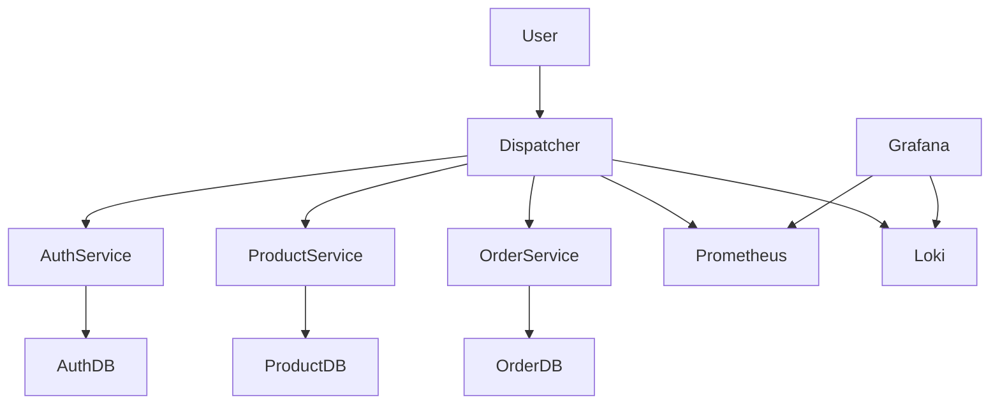
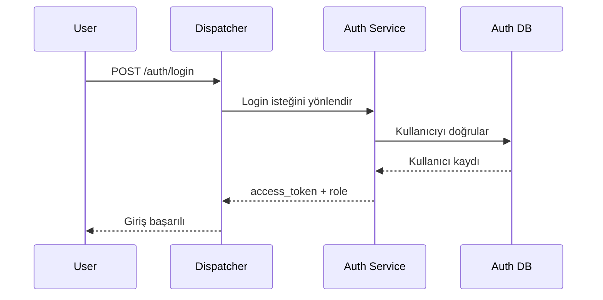
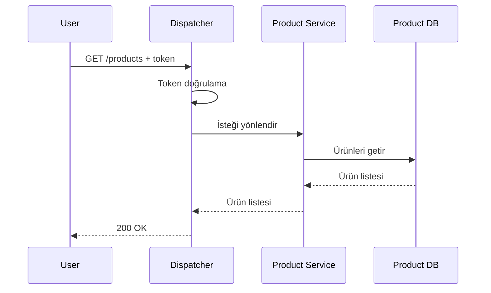
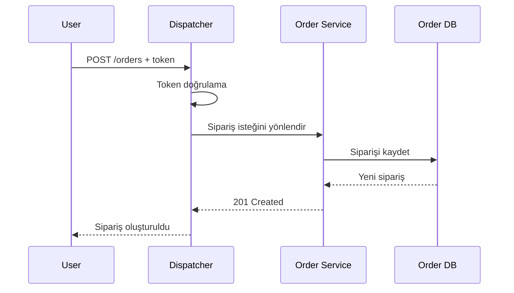

# Mikroservis Tabanlı Sipariş Sistemi

Bu proje, mikroservis mimarisi kullanılarak geliştirilen bir sipariş yönetim sistemidir. Sistem; kimlik doğrulama, ürün yönetimi, sipariş yönetimi ve merkezi istek yönlendirme işlevlerini birbirinden ayrılmış servisler üzerinden sunmaktadır. Projede ayrıca gözlemleme, loglama ve yük testi altyapıları da bulunmaktadır.

---

## İçindekiler

- [Proje Özeti](#proje-özeti)
- [Özellikler](#özellikler)
- [Kullanılan Teknolojiler](#kullanılan-teknolojiler)
- [Servisler](#servisler)
- [Sistem Mimarisi](#sistem-mimarisi)
- [Akış Diyagramları](#akış-diyagramları)
- [Proje Yapısı](#proje-yapısı)
- [Yetkilendirme Yapısı](#yetkilendirme-yapısı)
- [API Tasarımı](#api-tasarımı)
- [Veritabanı İzolasyonu](#veritabanı-izolasyonu)
- [Kurulum ve Çalıştırma](#kurulum-ve-çalıştırma)
- [Gözlemleme ve Loglama](#gözlemleme-ve-loglama)
- [Birim Testler ve Yük Testleri](#birim-testler-ve-yük-testleri)
- [Ekran Görüntüleri](#ekran-görüntüleri)
- [Sonuç](#sonuç)

---

## Proje Özeti

Bu sistemde kullanıcılar giriş yapabilir, ürünleri listeleyebilir ve sipariş oluşturabilir. Yönetici rolüne sahip kullanıcılar ise buna ek olarak ürün ekleyebilir. Tüm istemci istekleri doğrudan alt servislere değil, `dispatcher` servisine gönderilir. `dispatcher`, sistemi dış dünyaya açan tek giriş noktası olarak çalışır ve gelen istekleri ilgili mikroservislere yönlendirir.

Projede geliştirilen bileşenler:

- `dispatcher`
- `auth-service`
- `product-service`
- `order-service`
- her servis için ayrı MongoDB veritabanı
- Prometheus + Grafana metrik izleme
- Loki + Promtail log toplama
- k6 ile yük testi

---

## Özellikler

- Mikroservis mimarisi
- Merkezi `dispatcher` yapısı
- Rol tabanlı yetkilendirme (`admin`, `user`)
- Her servis için ayrı veritabanı
- Docker Compose ile tek komutta ayağa kaldırma
- Prometheus ile metrik toplama
- Grafana ile görselleştirme
- Loki + Promtail ile merkezi loglama
- k6 ile yük testi
- TDD yaklaşımıyla geliştirme

---

## Kullanılan Teknolojiler

- Python
- FastAPI
- Uvicorn
- Pytest
- Docker
- Docker Compose
- MongoDB
- Prometheus
- Grafana
- Loki
- Promtail
- k6

---

## Servisler

### 1. Dispatcher
Sistemin giriş noktasıdır. İstemciden gelen tüm istekleri alır, ilgili mikroservislere yönlendirir, token ve rol kontrolü yapar. Ayrıca request loglama ve metrics üretimi bu servis üzerinden gerçekleştirilir.

### 2. Auth Service
Kullanıcı giriş işlemlerini yönetir. Kullanıcı bilgileri kendi MongoDB veritabanında tutulur. Başarılı giriş sonrasında kullanıcıya token ve rol bilgisi döndürür.

### 3. Product Service
Ürün listeleme, ürün ekleme, ürün güncelleme ve ürün silme işlemlerini yönetir. Ürünler kendi MongoDB veritabanında tutulur.

### 4. Order Service
Sipariş oluşturma, sipariş görüntüleme, sipariş durumu güncelleme ve sipariş silme işlemlerini yönetir. Siparişler kendi MongoDB veritabanında tutulur.

---

## Sistem Mimarisi



---

## Akış Diyagramları

### Giriş Akışı


### Ürün Listeleme Akışı


### Sipariş Oluşturma Akışı


---

## Proje Yapısı
```
.
├── auth-service/           # Kimlik doğrulama mikroservisi
│   ├── app/                # Kaynak kodlar
│   ├── tests/              # TDD test dosyaları
│   ├── Dockerfile          # Servis imajı yapılandırması
│   └── requirements.txt    # Bağımlılıklar
├── dispatcher/             # API Gateway (Merkezi Giriş Noktası)
│   ├── app/
│   ├── tests/
│   ├── Dockerfile
│   └── requirements.txt
├── order-service/          # Sipariş yönetimi mikroservisi
│   ├── app/
│   ├── tests/
│   ├── Dockerfile
│   └── requirements.txt
├── product-service/        # Ürün yönetimi mikroservisi
│   ├── app/
│   ├── tests/
│   ├── Dockerfile
│   └── requirements.txt
├── infra/                  # İzleme ve Loglama altyapısı
│   ├── grafana/            # Görselleştirme dashboardları
│   ├── loki/               # Log toplama
│   ├── prometheus/         # Metrik toplama
│   └── promtail/           # Log iletimi
├── load-tests/             # Performans ve yük testleri
│   ├── screenshots/        # Test sonuç ekran görüntüleri
│   ├── k6/                 # k6 test scriptleri
│   └── results/            # JSON/HTML sonuç çıktıları
├── logs/                   # Test logları
├── docker-compose.yml      # Tüm sistemi ayağa kaldıran ana dosya
└── README.md               # Proje dökümantasyonu
```
---

## Yetkilendirme Yapısı

Sistemde iki temel rol bulunmaktadır:
- admin
- user

### Örnek kullanıcılar
| Rol   | Kullanıcı Adı | Şifre |
| ----- | ------------- | ----- |
| admin | admin         | 1234  |
| user  | user          | 1234  |

### Yetkiler
` user `
- giriş yapabilir
- ürünleri listeleyebilir
- sipariş oluşturabilir
- kendi siparişlerini görebilir

` admin `
- giriş yapabilir
- ürünleri listeleyebilir
- ürün ekleyebilir
- sipariş oluşturabilir
- tüm siparişleri görebilir

---

## API Tasarımı

Projede API tasarımı REST prensiplerine ve Richardson Maturity Model Seviye 2 yaklaşımına uygun olacak şekilde hazırlanmıştır. Kaynaklar URI ile tanımlanmış ve işlemler uygun HTTP metotları ile gerçekleştirilmiştir.

### Auth
- `POST /auth/login`

### Products
- `GET /products`
- `GET /products/{product_id}`
- `POST /products`
- `PUT /products/{product_id}`
- `DELETE /products/{product_id}`

### Orders
- `GET /orders`
- `GET /orders/{order_id}`
- `POST /orders`
- `PATCH /orders/{order_id}/status`
- `DELETE /orders/{order_id}`

### Kullanılan HTTP durum kodları
- `200 OK`
- `201 Created`
- `401 Unauthorized`
- `403 Forbidden`
- `404 Not Found`
- `503 Service Unavailable`

---

## Veritabanı Izolasyonu

Her mikroservis kendi veritabanını kullanmaktadır:

- `auth-service` → `auth_db`
- `product-service` → `product_db`
- `order-service` → `order_db`

Bu yapı sayesinde servisler veri katmanında birbirinden bağımsız çalışmaktadır.

---

## Kurulum ve Çalıştırma
### Gereksinimler
- Docker
- Docker Compose

### Uygulamayı ayağa kaldırma
```powershell
docker compose up --build
```

### Arayüzler
- Dispatcher Swagger: `http://127.0.0.1:8000/docs`
- Grafana: `http://127.0.0.1:3000`
- Prometheus: `http://127.0.0.1:9090`

### Grafana giriş bilgileri
- kullanıcı adı: `admin`
- şifre: `admin`

---

## Gözlemleme ve Loglama

Projede dispatcher servisi üzerinden üretilen metrikler Prometheus tarafından toplanmakta, Grafana ile görselleştirilmektedir. Log kayıtları ise Promtail aracılığıyla Loki’ye aktarılmakta ve Grafana üzerinden izlenebilmektedir.

---

## Birim Testler ve Yük Testleri

### Birim Testler
Projede `pytest` kullanılmıştır.

#### Test kapsamı örnekleri:
- health endpoint testleri
- auth login testleri
- yetkisiz erişim testleri
- invalid token testleri
- admin/user rol testleri
- ürün ekleme ve ürün listeleme testleri
- sipariş oluşturma ve sipariş görüntüleme testleri
- servis erişilememe durumları

### Yük Testleri
Yük testleri `k6` ile gerçekleştirilmiştir. Test senaryolarında aşağıdaki işlemler tekrarlı olarak çalıştırılmıştır:
- login
- ürün listeleme
- sipariş oluşturma
- belirli oranlarda admin kullanıcı ile ürün ekleme

#### 50 Sanal Kullanıcı Testi
- maksimum kullanıcı: `50`
- test süresi: `3 dakika`
- sistem stabil çalıştı

#### 100 Sanal Kullanıcı Testi
- maksimum kullanıcı: `100`
- toplam HTTP istek: `8778`
- başarısız istek oranı: `0.00%`
- ortalama istek süresi: `272.39 ms`
- p95: `969.84 ms`

Bu sonuçlar sistemin belirlenen yük altında kararlı şekilde çalışabildiğini göstermektedir.

---

## Ekran Görüntüleri

### Prometheus Targets

Prometheus "Target Health" paneli üzerinden Dispatcher servisinin sağlık durumunun (Health Check) izlenmesi. http://dispatcher:8000/metrics uç noktasının aktif olarak taranması ve servisin "UP" (çalışır durumda) olduğu doğrulanmaktadır.

### Grafana Metrics Dashboard (50 ve 100 Sanal Kullanıcı)


k6 yük testi sırasında sistemin performans metriklerinin gerçek zamanlı görselleştirilmesi. Grafik üzerinde eş zamanlı isteklerin (http_requests_total) ve sistem kaynak kullanımının (memory_bytes) zaman içindeki değişimi ile yük altındaki sistem davranışı analiz edilmektedir.

### Loki Logs

Dispatcher üzerinden geçen tüm trafiğin Grafana Loki üzerinde merkezi olarak loglanması. Görselde, gelen isteklerin HTTP metodları (GET/POST), yönlendirilen yollar (/products, /metrics) ve yanıt sürelerinin (duration_ms) JSON formatında detaylı takibi görülmektedir.

### k6 Load Test

100 eş zamanlı sanal kullanıcı ile gerçekleştirilen, 4 kademeli ve 3 dakika 30 saniyelik yük testi terminal çıktısı. Toplam 8778 isteği %100 başarı oranı (0.00% failure) ile karşılamış ve belirlenen performans eşiklerini (p(95) < 1000ms) başarıyla geçmiştir.

---

## Sonuç

Bu projede mikroservis mimarisi kullanılarak modüler, genişletilebilir ve izlenebilir bir sipariş sistemi geliştirilmiştir. Her servisin kendi sorumluluk alanına ve kendi veritabanına sahip olması sayesinde servis izolasyonu sağlanmıştır. Dispatcher katmanı sayesinde istemci ile servisler arasındaki iletişim merkezi hale getirilmiştir.
